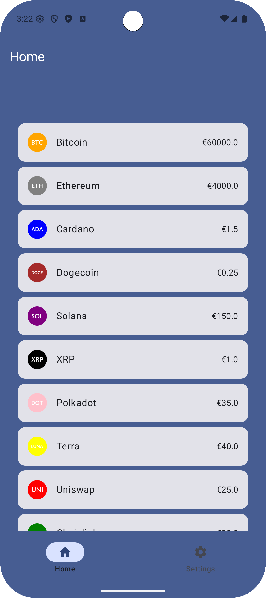
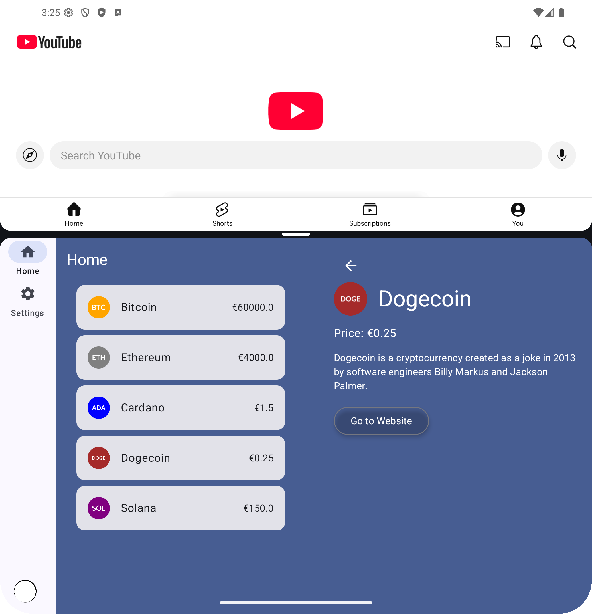

# ResizableApp


**ResizableApp** is a proof-of-concept Android app demonstrating **resizable UI patterns** for phones, tablets, and foldable devices using **Jetpack Compose**.

---

## 🎯 Features

- Adaptive layouts for multiple screen sizes
- **NavigationSuiteScaffold**: Unified BottomBar + NavigationRail
- **ListDetailPaneScaffold** to have an auto-handled ListPane and DetailPane
- Centralized navigation with `NavHost` & `AppDestinations`
- Mock cryptocurrency data for demonstration
- Clean modular Compose architecture

---

## 🖥 Screenshots / Demo


<table>
  <thead>
    <tr>
      <th scope="col">Compact</th>
      <th scope="col">Large</th>
    </tr>
  </thead>
  <tbody>
    <tr>
      <td>
        
        
        
      </td>
      <td>
        
        
        
      </td>
    </tr>
  </tbody>
</table>

---

## 📁 Project Structure

```bash
com.gd.resizableapp/
├─ core/ # Navigation & utilities
├─ featuredetail/ # Detail screen
├─ featurehome/ # Home screen & components
├─ featuresettings/ # Settings screen
├─ model/ # Data models
├─ ui/ # Theme & scaffold
└─ MainActivity.kt # Entry point
```

---

## 🚀 How to Run

```bash
git clone https://github.com/Gaetano-Dati/resizableapp.git
```

1. Open in Android Studio
2. Build & run on any device or emulator
3. Resize window to see adaptive layouts in action
4. Rotate the phone to study which data are shown everytime
